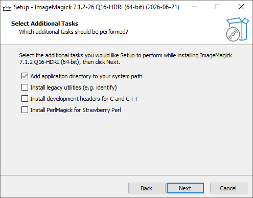

### How to install ImageMagick 7 on Windows and leave it working in the PATH

ImageMagick is used to convert images from the command line. In FFmulticonverter for Windows it is important to use **ImageMagick 7** with the command:

```powershell
magick
```

It is not advisable to use directly:

```powershell
convert
```

because Windows already includes a program called `convert.exe` in:

```powershell
C:\Windows\System32\convert.exe
```

That Windows `convert.exe` is not ImageMagick, but a system tool for converting file systems. That is why it can cause a conflict if a program tries to call `convert` to convert images.

# Download ImageMagick 7

Go to the official page:

[https://imagemagick.org/download/#gsc.tab=0](https://imagemagick.org/download/#gsc.tab=0)


Scroll down to the section:

**Windows binary release**

On 64-bit Windows I recommend downloading the version:

```text
ImageMagick-7.x.x-xx-Q16-HDRI-x64-dll.exe
```

For example:

```text
ImageMagick-7.1.2-26-Q16-HDRI-x64-dll.exe
```

This is the version for 64-bit Windows, with dynamic DLL libraries, 16 bits per pixel and HDRI support.

# Recommended options in the installer

When you get to the **Select Additional Tasks** screen, leave this checked:

```text
Add application directory to your system path
```


And leave these options unchecked:

```text
Install legacy utilities (e.g. identify)
Install development headers for C and C++
Install PerlMagick for Strawberry Perl
```

The important option is **Add application directory to your system path**, because that allows you to use `magick` from PowerShell or CMD without typing the full path to the program.

The **Install legacy utilities** option is not necessary for FFmulticonverter. Also, on Windows it is better to avoid depending on old commands like `convert`, because the name can be confused with the system `convert.exe`.

# Verify that ImageMagick works

After finishing the installation, close all PowerShell or CMD windows that were open.

This is necessary because terminals that were already open before installing ImageMagick do not automatically reload environment variables. Even if the installer added ImageMagick to the PATH, an old PowerShell window may not recognize the `magick` command.

Open a new PowerShell and type:

```powershell
magick --version
```

If everything is fine, something similar to this should appear:

```text
Version: ImageMagick 7.1.2-26 Q16-HDRI x64
Copyright: (C) 1999 ImageMagick Studio LLC
License: https://imagemagick.org/license/
```

With that, ImageMagick 7 is now correctly installed in the PATH.

# Quick conversion test

To test a conversion from PowerShell, enter a folder where you have a PNG image and run:

```powershell
magick "imagen.png" "imagen.jpg"
```

You can also test with full paths:

```powershell
magick "C:\Users\wachi\Pictures\imagen.png" "C:\Users\wachi\Pictures\imagen.jpg"
```

If the `.jpg` file is created, ImageMagick is working correctly.

# Note for FFmulticonverter on Windows

For FFmulticonverter on Windows these three commands must work from a new PowerShell:

```powershell
ffmpeg -version
soffice --version
magick --version
```

If all three respond, FFmulticonverter can use:

- FFmpeg for audio and video.
- LibreOffice for documents.
- ImageMagick 7 for images.

Important reminder:

```text
On Windows use magick, not convert.
```
